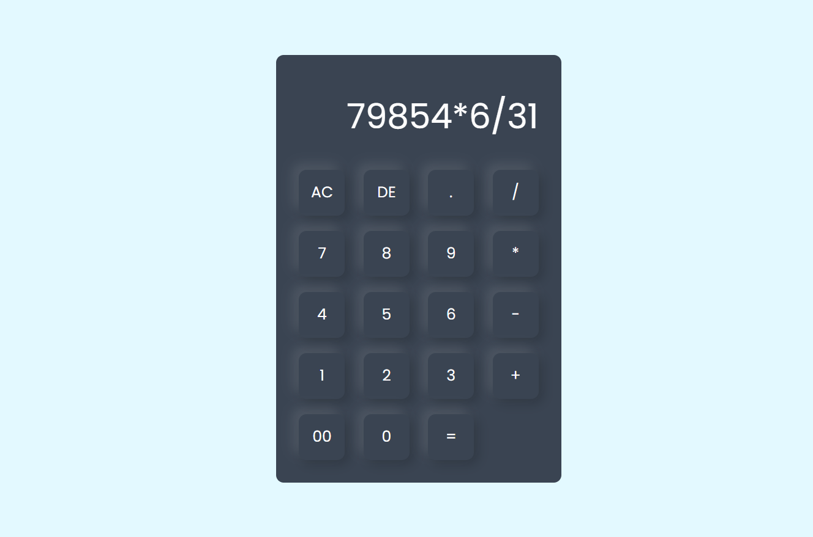

 # 🧮 Simple Calculator

A simple calculator built using **HTML, CSS, and JavaScript**.  
This project performs basic arithmetic operations like addition, subtraction, multiplication, and division.

---

## 🚀 Features

- ➕ Addition
- ➖ Subtraction
- ✖ Multiplication
- ➗ Division
- 🧹 AC (Clear All) button
- ⌫ DE (Delete Last Character)
- 📱 Responsive design

---

## 🛠️ Built With

- HTML5  
- CSS3  
- JavaScript  

---

## 📂 Project Structure

```
📁 simple-calculator
 ├── index.html
 ├── style.css
 ├── input.png
 ├── output.png
 └── README.md
```

---

## 📸 Screenshot




---

## 📖 How to Run the Project

1. Clone the repository:
   ```bash
   git clone https://github.com/Sridhar-Sahu-code/Simple-Calculator.git
   ```

2. Open the folder.

3. Open `index.html` in your browser.

---

## ⚠️ Note

This project uses JavaScript's `eval()` function to calculate results.  
While it works for small projects, `eval()` is not recommended for production applications.

---

## 💡 Future Improvements

- Add keyboard support
- Improve UI design
- Add scientific functions
- Replace `eval()` with a safer alternative

---

## 👨‍💻 Author

Your Name  
GitHub: https://github.com/Sridhar-Sahu-code

---

## 📄 License

This project is open-source and free to use.
